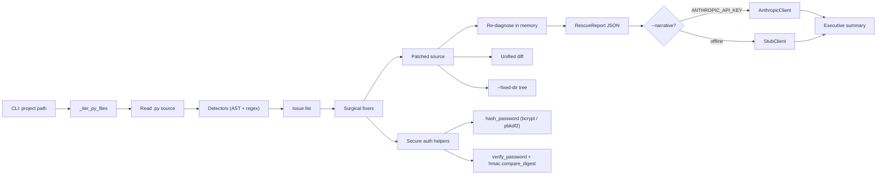

# Vibe Code Rescue

**Ship your broken AI-generated app, secured** — 24 tests; AST-based fixer that patches arbitrary AI-generated code and rebuilds auth securely (hashed + constant-time). It finds the seven dangerous bugs
AI assistants reliably emit and applies **surgical, line-level fixes** to *your*
source — turning a plaintext password check into a salted, constant-time hash, an
f-string SQL query into a parameterized one, and an unguarded admin route into an
auth-gated one — then hands you a unified diff and a per-fix rationale. Exits
non-zero until no issues remain (CI-friendly); `pytest` green offline, stdlib-only.

AI assistants reliably emit the same dangerous bugs: plaintext password checks,
SQL built by string concatenation, debug mode left on, unguarded admin routes,
and secrets hard-coded in source. This tool finds those bugs in **arbitrary
Python source** and applies **surgical** fixes — it rewrites the lines that are
wrong and leaves everything else untouched — then hands you a unified diff and a
per-fix rationale you can drop straight into a PR.

It is not a linter that only complains, and it is not a template stamper that
overwrites your files with someone else's app. It edits *your* code.

---

## Architecture



---

## What it detects and fixes

| Issue | Severity | Fix it applies |
|---|---|---|
| Plaintext password comparison (`plain == stored`) | critical | Real password hashing (bcrypt, or stdlib `pbkdf2_hmac`) verified with `hmac.compare_digest` |
| SQL built by f-string / string concat | critical | Parameterized query with `?` placeholders and bound params |
| Sensitive route with no auth guard | critical | Injects a `require_admin()` bearer-token check (constant-time) at the top of the handler |
| `DEBUG = True` / `app.run(debug=True)` | high | Env-driven `DEBUG`, default `False` |
| Hard-coded secret (`SECRET_KEY = "..."`) | high | Loads from `os.environ` with a non-secret dev fallback |
| Wrong table name (`FROM user` vs `users`) | high | Corrects the table name |
| Wildcard CORS (`ALLOW_ALL_ORIGINS = True`) | medium | Explicit env-driven allow-list |

Detection is done with Python's `ast` module (for structural facts like "this
route handler calls no auth guard") plus targeted regex (for textual patterns
like f-string SQL). The fixers operate on the real source, so two different
inputs produce two different, correct outputs.

### The security own-goal this tool refuses to make

A naive "fixer" might leave (or even introduce) a plaintext password check. The
remediated authentication here **never** compares plaintext. The injected
`verify_password` hashes the candidate and compares in constant time:

```python
def verify_password(plain: str, stored_hash: str) -> bool:
    if stored_hash.startswith("pbkdf2_"):
        prefix, rounds_s, salt_hex, digest_hex = stored_hash.split("$", 3)
        algo = prefix.split("_", 1)[1]
        candidate = hashlib.pbkdf2_hmac(algo, plain.encode("utf-8"),
                                        bytes.fromhex(salt_hex), int(rounds_s))
        return hmac.compare_digest(candidate, bytes.fromhex(digest_hex))
    if _bcrypt is not None:
        return _bcrypt.checkpw(plain.encode("utf-8"), stored_hash.encode("utf-8"))
    return False  # unknown format: refuse, never fall back to plaintext
```

---

## Real before / after (from `sample_input/broken_app/`)

**`app.py` — the password check:**

```diff
 def verify_password(plain: str, stored_hash: str) -> bool:
-    # BUG: inverted comparison — accepts wrong passwords
-    return plain != stored_hash
+    """Constant-time verification of a password against a stored hash."""
+    ... hash + hmac.compare_digest ...
```

**`db.py` — the query:**

```diff
-    query = f"SELECT id, email, password_hash FROM user WHERE email = '{email}'"
-    row = conn.execute(query).fetchone()
+    query = "SELECT id, email, password_hash FROM users WHERE email = ?"
+    row = conn.execute(query, (email,)).fetchone()
```

**`app.py` — the admin route:**

```diff
 @app.route("/admin/users")
 def admin_users():
+    if not require_admin():
+        return jsonify({"error": "unauthorized"}), 401
     users = list_all_users(app.db)
     return jsonify(users)
```

Note the comments and surrounding structure are preserved — these are line-level
patches, not rewrites.

---

## How to run

The tool is **stdlib-only** at runtime — no install step required.

```bash
# Diagnose + surgically fix any project (or a single .py file)
python3 vibe_code_rescue.py path/to/app --out report.json --fixed-dir fixed/ --diff changes.diff

# Diagnose only (no edits)
python3 vibe_code_rescue.py path/to/app --diagnose-only --out diagnosis.json

# Try it on the bundled example
python3 vibe_code_rescue.py sample_input/broken_app \
  --out output/sample_report.json --fixed-dir output/fixed_app --diff output/sample.diff
```

The input tree is never mutated — the patched sources are written to
`--fixed-dir`. An optional executive summary is added with `--narrative` (uses
Claude when `ANTHROPIC_API_KEY` is set, otherwise a deterministic offline
reference implementation).

`bcrypt` is used for password hashing when it is installed; otherwise the tool
falls back to the standard library's `pbkdf2_hmac`. Either way the result is a
salted, slow, constant-time-verified hash.

### Run the tests (offline, no API key, no network)

```bash
python3 -m pytest -q
```

The suite feeds the fixers **genuinely different inputs** (different function
names, arg names, filenames) and asserts on behavior — e.g. it execs the rescued
`verify_password` and checks it accepts the right password and rejects the wrong
one. It explicitly verifies that two different inputs do **not** collapse to one
canned output.

---

## Output

`report.json` contains:

- `before` / `after` — issue counts by severity with file + line numbers
- `fixes_applied` — one entry per fix with `fix_id`, a human `rationale`, and a
  unified `diff`
- `narrative` — optional executive summary

Exit code is `0` when no issues remain after the rescue, `1` otherwise — CI-friendly.

---

## Project layout

```
vibe-code-rescue/
├── vibe_code_rescue.py          # detectors (ast + regex) + surgical fixers + CLI
├── test_vibe_code_rescue.py     # offline pytest suite (behavioral)
├── sample_input/broken_app/     # example app with the bugs above
├── output/                      # committed sample report, patched tree, diff
├── requirements.txt             # optional: anthropic (narrative), pytest (tests)
└── README.md
```

---

Built by [clira](https://clira.dev) — security rescue for AI-generated apps: it edits *your* code, surgically.
